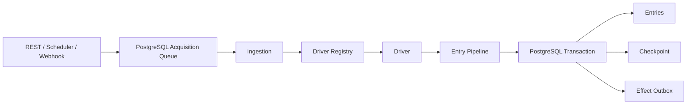

# Pulse Core Design

## Overview

第一阶段从最小纵向切片开始，证明 Source 可以注册、Acquisition 可以持久化和领取、Driver 可以产出 Candidate，并由 Entry Pipeline 在 PostgreSQL 中幂等提交 Entry 与 Checkpoint。

完整架构见 [docs/architecture.md](../../../docs/architecture.md)，领域语言见 [CONTEXT.md](../../../CONTEXT.md)。

## Architecture



## Initial Interfaces

```go
type Ingestion interface {
    RegisterSource(context.Context, SourceSpec) (Source, error)
    Enqueue(context.Context, AcquisitionCommand) error
    ProcessNext(context.Context) (ProcessResult, error)
}

type Driver interface {
    Kind() SourceKind
    Validate(context.Context, SourceSpec) (ValidatedSpec, error)
    Acquire(context.Context, AcquireRequest) (AcquisitionBatch, error)
}
```

第一条切片使用测试 Driver，不立即实现真实 HTTP。它通过 Ingestion 外部接口验证深模块形状，避免先写大量浅层 Adapter。

## Persistence

首批迁移包含：

- `sources`
- `source_checkpoints`
- `acquisitions`
- `entries`

关键约束：

- `sources(driver_kind, normalized_locator)` 唯一。
- `entries(source_id, identity_key)` 唯一。
- Acquisition 领取使用 `FOR UPDATE SKIP LOCKED`。
- Entry Upsert 与 Checkpoint 更新共享事务。

## Error Handling

- 配置错误：返回字段级 Validation Error，不创建 Source。
- 未注册 Driver：Acquisition 失败且不修改 Checkpoint。
- Driver 暂时错误：任务进入带退避的 retry 状态。
- Pipeline 或事务错误：回滚 Entry 与 Checkpoint。
- 重复命令：由 Command ID 和 Entry Identity 幂等吸收。

## Test Strategy

### Unit

- SourceSpec 校验与 Locator 规范化。
- Identity Key 优先级。
- Pipeline 对新增、更新和 Tombstone 的决定。
- Driver Registry 的注册与未知类型错误。

### PostgreSQL Integration

- Source 唯一约束。
- 并发 Worker 只领取一次 Acquisition。
- 重试不重复 Entry。
- Pipeline 失败时 Checkpoint 不前移。
- 成功时 Entry 和 Checkpoint 原子提交。

### E2E

第一条切片只验证 REST 创建 Source、触发测试 Acquisition 和查询 Entry。UI 与真实 RSS Driver 在后续任务加入。

## Security

第一条切片不存储真实凭据，但配置结构必须将 Secret Reference 与普通 JSON 分开。后续 HTTP Driver 只能使用统一安全 Client。

## Reader Interface

桌面端采用固定左侧导航与右侧阅读流。左侧按“全局视图、一级 Folder、Source、管理入口”组织；右侧默认加载统一收件箱，并以来源、标题、摘要和时间组成紧凑单行。点击 Source 时，客户端通过 `GET /api/v1/entries?source_id=...` 请求服务端筛选结果，避免在大数据量下进行客户端过滤。

点击 Entry 不离开列表，而是在当前行下方展开正文、原文链接、已读、收藏、稍后阅读、显示标题和笔记操作；再次点击或使用“收起”恢复紧凑列表。窄屏下导航改为顶部横向区域，文章行隐藏来源和摘要列，保留标题、时间与展开能力。

Reader 使用白名单清洗后渲染 Feed 富文本，仅保留排版元素以及 HTTP(S) 链接和图片；脚本、表单、内嵌页面、事件属性和危险协议全部移除。图片延迟加载并限制在正文宽度内。RSS Driver 优先使用 `content:encoded`，并在正文缺图时补充 Media RSS 缩略图或图片 Enclosure。Feed Checkpoint 带解析器版本，解析能力升级后强制完整抓取一次，再恢复 ETag/Last-Modified 条件请求。

删除 Source 使用 `DELETE /api/v1/sources/{id}`，成功返回 204。该操作只设置 `enabled=false` 与 `archived_at`：Source 从公开查询、Folder 计数和后续 Acquisition 领取中消失，已有 Entry、阅读状态、收藏和笔记继续保留。界面必须在执行前显示确认对话框，并明确说明历史内容不会删除。

Reader 采用高吞吐信息流交互：点击未读 Entry 时立即标记已读并将展开行平滑滚动到阅读区域顶部；再次点击或按 `Escape` 收起。收藏、稍后阅读、改回未读和标题/笔记编辑放入溢出菜单。顶部工具栏提供批量已读操作；在综合列表中更新所有未读 Entry，在单个 Source 中通过 `source_id` 限定更新范围。
