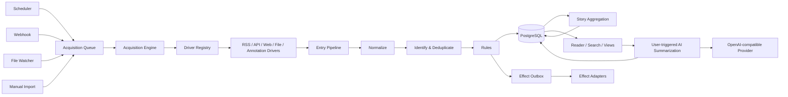

# Pulse Architecture

## 1. Goals

Pulse 是单用户、本地优先的信息摄取与阅读中枢。架构首先保证：

- 支持定时拉取、外部推送、文件监控和手工导入等不同摄取方式。
- 新增信息源类型时，不修改阅读、搜索、规则和存储模块。
- 重试不会生成重复 Entry、重复标签或重复外部通知。
- 进程崩溃后能够从持久化状态恢复。
- 第一阶段使用模块化单体和 PostgreSQL；PostgreSQL 是唯一有状态基础设施。
- 运行于普通 Linux 服务器，通过 Docker Compose 部署，仅面向本机和局域网。
- 第一阶段不设计用户、登录、角色或权限体系。

暂不包含多用户、权限、协作和跨设备同步。

## 2. Architectural Shape



系统采用模块化单体。Go 后端提供 REST/OpenAPI 接口，TypeScript/React 前端通过 SSE 接收提交后的轻量变更信号，再用 HTTP 读取权威数据。Web、Scheduler、Acquisition Worker 和 Effect Worker 使用同一镜像并可按角色启动；默认由一个容器运行全部角色。

### 2.1 Reader realtime updates

`GET /api/v1/events` 提供进程内 SSE 广播。Entry 批次只有在完整事务提交后才发布信号；Story 聚合成功合并、Reader 状态变化、Source/Folder/View/Rule 等管理变更也会发布信号。信号是短小的失效通知，不携带 Story 或 Entry 内容，不保证重放，也不引入 Redis、WebSocket 或其他有状态队列。连接发送标准 `EventSource` `retry` 提示和心跳注释；客户端断线超过 30 秒显示弱连接状态，并通过 HTTP 重新协调。

Reader 的查询、筛选、搜索和游标分页始终由服务端执行，TanStack Query 只管理 Sources、Folders、Story 列表/详情及有限的失效与重取。当前页面可见、没有展开 Story 且文章列表滚动位置不超过 80px 时，新内容可以自动重取；否则保留“有 N 条新内容”提示，用户确认后再更新。已存在 Entry 的更新，或新 Entry 被归入已有 Story，不计为新的 Story 提示；展开的 Entry 正文不会被实时替换。未读数量同时更新侧栏和浏览器标题。跨标签页只通过 `BroadcastChannel` 传播失效，不复制内容，仍以 HTTP 重取为准。

## 3. The Stable Ingestion Seam

所有摄取入口先创建统一命令：

```go
type AcquisitionCommand struct {
    ID           CommandID
    SourceID     SourceID
    Trigger      Trigger
    Payload      PayloadRef
    RequestedAt  time.Time
}

type Trigger string

const (
    TriggerSchedule   Trigger = "schedule"
    TriggerWebhook    Trigger = "webhook"
    TriggerFileChange Trigger = "file_change"
    TriggerManual     Trigger = "manual"
    TriggerImport     Trigger = "import"
)
```

`PayloadRef` 可以为空、包含已落盘的推送正文、文件路径或导入对象的引用。队列中不保存任意大小的正文。

Acquisition Engine 的外部接口保持很小：

```go
type Ingestion interface {
    RegisterSource(ctx context.Context, spec SourceSpec) (Source, error)
    Enqueue(ctx context.Context, command AcquisitionCommand) error
    ProcessNext(ctx context.Context) (ProcessResult, error)
}
```

调用方只需要知道 Source 和 Trigger，不需要理解 RSS、DOM、分页 API 或文件格式。

## 4. Driver Model

Driver 是变化发生的主要 seam：

```go
type Driver interface {
    Kind() SourceKind
    Validate(ctx context.Context, spec SourceSpec) (ValidatedSpec, error)
    Acquire(ctx context.Context, req AcquireRequest) (AcquisitionBatch, error)
}

type AcquireRequest struct {
    Source      Source
    Trigger     Trigger
    Payload     io.Reader
    Checkpoint  Checkpoint
    Limits      AcquisitionLimits
}

type AcquisitionBatch struct {
    Candidates     []Candidate
    NextCheckpoint Checkpoint
    SuggestedNext  *time.Time
    Diagnostics    Diagnostics
}
```

Driver 负责外部协议和来源特有知识：

- RSS Driver：HTTP 条件请求、RSS/Atom/JSON Feed 解析。
- API Driver：静态认证、声明式分页、速率限制、JSONPath 字段映射。
- Web Driver：静态 HTML 获取、CSS Selector 提取、页面指纹。
- Webhook Driver：校验签名并解析推送 Payload。
- Manual Driver：接收粘贴 URL、浏览器扩展或书签脚本保存的内容；只有 URL 时通过受控 HTTP Client 获取页面，使用 Readability 提取正文并保存清理后的快照，提取失败仍产出 URL-only Candidate。
- File Driver：读取白名单目录中的 Markdown、HTML 或目录变化。
- Annotation Driver：接收 Apple Books、Kindle 或其他阅读器的结构化批注批次，为每条 Annotation 生成一个 Candidate。

Driver 不负责 Entry 去重、规则、标签、阅读状态或数据库事务。需要 JavaScript 的 Browser Driver 属于后续阶段，并作为独立可选 Worker 接入，避免 Chromium 成为核心运行时依赖。

### Capability declaration

每个 Driver 声明能力，Source 创建和界面配置据此进行校验：

```go
type DriverCapabilities struct {
    AcceptedTriggers []Trigger
    SupportsCursor   bool
    SupportsETag     bool
    SupportsPreview  bool
    RequiresNetwork  bool
}
```

不要用能力声明代替行为判断；它只用于配置校验和界面展示。

### Source cardinality and identity

配置向导区分：

- **Single document**：一个 Source 对应一个持续更新的 Entry，`source_id` 足以参与身份识别。
- **Collection**：一个 Source 产生多个 Entry，每个 Candidate 必须有稳定身份。

Collection 的身份字段优先级为来源 ID/GUID、永久链接、用户选择的字段组合、标题加发布时间，最后才允许单独使用标题。使用标题兜底时界面必须提示标题修改可能产生重复内容。

每条独立 RSS 地址对应一个 Source。Source 可以属于多个一级 Folder；不支持嵌套 Folder。

### Configuration wizard

Source 必须能通过界面创建，不要求用户编辑 YAML 或 JSON：

```text
选择 Source 类型
  → 配置地址和静态认证
  → 测试连接并查看脱敏响应
  → 选择单文档或列表
  → 定位列表并映射字段
  → 选择身份字段和分页方式
  → 预览 Candidate 与 Entry
  → 设置首次摄取范围
  → 保存并启用
```

API 支持页码、响应中的下一页 URL 和游标三种声明式分页，不执行任意脚本。首次摄取默认最近 100 条，也可选择最新一页、最近 N 条或全部历史；全部历史必须分批处理并受最大页数、Entry 数和总耗时限制。

静态 HTML 列表通过可视化点选生成 CSS Selector，自动识别只提供建议。一次提取为 0 条时视为配置异常，不提交 Checkpoint；连续失败后暂停并告警。

第一阶段认证方式仅包括无认证、Basic Auth、API Key、Bearer Token 和自定义 Header。不支持 OAuth、网页登录或 Cookie 自动续期。

## 5. Entry Pipeline

Driver 产出的 Candidate 使用宽松模型，允许缺失字段并保留来源元数据：

```go
type Candidate struct {
    ExternalID  string
    URL         string
    Title       string
    Author      string
    Summary     string
    Content     Content
    PublishedAt *time.Time
    Attachments []Attachment
    RawMeta     map[string]any
}
```

后续流水线固定为：

1. **Normalize**：字符集、时间、URL、HTML 和正文格式统一。
2. **Identify**：计算稳定身份键和内容指纹。
3. **Deduplicate**：更新已有 Entry 或插入新 Entry。
4. **Enrich**：可选的正文提取、语言识别、摘要和附件分析。
5. **Apply Rules**：重新求值结构化规则，执行数据库动作并创建 Effect。
6. **Commit**：原子提交 Entry、Checkpoint 和 Effect Outbox。

统一身份按以下优先级计算：

1. `source_id + external_id`
2. `source_id + canonical_url`
3. `source_id + normalized_url`
4. `source_id + content_fingerprint`

跨 Source 的近似去重由 Story 模块完成。每个 Entry 必须且只能属于一个 Story；
未匹配内容形成单 Entry Story。Story 是 Reader 的聚合根，拥有阅读状态、用户显示标题、Note 和标签；Story 不合并或删除底层 Entry，
避免把转载、修订或不同媒体版本误判为同一记录。聚合列表展示 Story，按 Source 浏览展示 Entry，
但 Entry 行显式携带所属真实 Story 的身份与阅读状态。

Story 聚合使用传统文本特征与 embedding 候选集合的并集。URL、正文哈希、标题、
SimHash 和时间提供确定性及可解释信号，embedding 负责发现大幅改写和跨语言候选；
日期、数字、型号和事件方向冲突可以否决自动聚合。自动聚类只允许把待处理的单 Entry Story 吸收到已有 Story，
不会合并两个已经形成的多 Entry Story；后者只能通过带冲突处理的人工合并完成。Story 的成员数量、
Source 数量和首末发布时间从成员关系实时计算，不在 Story 行缓存。Story 使用创建时固定的排序时间，
后续加入新 Entry 不会让已读 Story 静默回到列表顶部。合并删除的 Story ID 记录为指向存活 Story 的扁平别名。

相同身份的 Candidate 更新原 Entry，不保留正文历史版本。来源标题和正文保存在 Entry；用户的显示标题和 Note 保存在 Story，来源更新不得覆盖用户内容。来源中暂时缺失的 Entry 不删除；明确删除事件只设置 `source_deleted`。

Reader 移除只更新 Story 的隐藏状态；维护者永久删除 Entry 时留下 `source_id + identity_key` Tombstone，防止来源再次返回时复活。删除最后一个 Entry 还必须确认将丢失的 Story 元数据。删除 Source 默认停止摄取并归档 Source，历史 Entry 保留；批量删除内容必须显式选择。

## 6. Checkpoints and Transaction Boundary

Checkpoint 只有在整个批次成功写入后才能前移：

```text
取得 Source Lease
  → Driver Acquire
  → Normalize / Identify
  → BEGIN
      Upsert Entries
      Apply database Rules
      Insert Effects into Outbox
      Save Checkpoint
      Mark Acquisition succeeded
    COMMIT
  → Release Lease
```

如果进程在提交前崩溃，旧 Checkpoint 会让批次重新取得；幂等键防止重复 Entry。如果进程在提交后、发送通知前崩溃，Outbox Worker 会继续处理尚未完成的 Effect。

Driver 不得自行持久化 Checkpoint。

## 7. Scheduling and Queueing

第一阶段使用 PostgreSQL 持久化队列：

- Scheduler 查询 `next_run_at <= now()` 且启用的 Source。
- 为拉取型 Source 获取带过期时间的 Lease，防止手工刷新与定时任务重叠；重复刷新命令合并。
- Webhook Source 接收的每个请求独立排队并允许有限并发，不共享拉取 Checkpoint。
- Acquisition 使用状态 `pending/running/succeeded/retry/dead`。
- 网络和远端限流错误指数退避；配置错误直接暂停 Source。
- 同一域名设置并发上限和最小请求间隔。
- 手工刷新可以提升优先级，但仍受安全与域名限流约束。

Worker 使用 `FOR UPDATE SKIP LOCKED` 领取任务。第一阶段不引入 Redis；只有 PostgreSQL 队列成为可测量瓶颈时才替换外部队列。

AI Summarization 使用独立的 PostgreSQL `ai_jobs` 队列，但复用相同的 Claim/Lease/Retry 原则。它只有一个全局 Provider seam：`OpenAICompatibleAdapter` 发送 Chat Completions 请求，OpenAI、DeepSeek、OpenRouter、Qwen 和 Ollama 通过 Base URL、Model、API Key 与可选 Header 配置，不为每家供应商创建领域分支；当前 DeepSeek 部署通过适配器配置固定使用非思考模式。AI 调用由用户显式触发；StorySummary 保存当前 Story 输入指纹并在内容变化后标记过期，Catch-up Digest 保存固定的标题-only Story 快照和历史结果。Digest 不读取正文、不修改 Reader 状态，结构化结果中的 Story ID 由服务端从快照标签映射，避免模型直接决定持久化 ID。AI 队列还通过 PostgreSQL 事务锁和 `PULSE_AI_MAX_ACTIVE_JOBS` 限制积压，避免重复点击无限增加 Provider 请求。

抓取频率提供实时、较快、普通和低频四档，系统根据历史更新频率自适应调整；高级设置允许固定间隔。所有策略仍服从 `Retry-After`、缓存头、失败退避和域名级限流。

## 8. Persistence Model

核心表：

```text
sources
source_checkpoints
acquisitions
entries
stories
story_entries
entry_annotations
entry_tombstones
folders
tags
story_tags
story_rule_tags
story_aliases
rules
rule_executions
effects
views
diagnostic_snapshots
ai_jobs
story_ai_summaries
ai_digests
ai_digest_stories
```

重要约束：

- `sources(driver_kind, normalized_locator)` 唯一。
- `sources.navigation_position` 保存 Source 的 root 导航位置；`folders.navigation_position` 保存 Folder 列表位置；`source_folders.navigation_position` 保存每个 Folder 内独立的 Source 位置。root 展示只包含没有任何 Folder membership 的 Source。
- `entries(source_id, identity_key)` 唯一。
- `story_entries(entry_id)` 唯一，并由可延迟约束在事务提交时保证每个 Entry 恰属一个 Story；每个 Story 非空，代表 Entry 非空且必须属于该 Story。
- `story_aliases(alias_id)` 唯一并直接指向规范 Story，合并时压平别名链。
- `entry_annotations(entry_id)` 唯一，Annotation 与 Entry 同一事务提交；来源 Annotation 不得覆盖 Story 上由用户维护的 Note。
- `rule_executions(rule_id, rule_version, entry_id)` 唯一。
- `effects(idempotency_key)` 唯一。
- Source 配置与 Checkpoint 分开保存，修改显示名称不会重置摄取进度。
- 成功原始响应不长期保存；失败响应可以保存脱敏、限大小、最长 7 天的诊断快照。

搜索第一阶段留在 PostgreSQL：英文使用 `tsvector`，中文使用规范化文本和 `pg_trgm` 进行关键词与模糊匹配。搜索模块拥有独立接口，未来可以接入 Meilisearch 或 OpenSearch Adapter。

规则使用结构化条件和动作，不执行 JavaScript、Python 或 Shell。Entry 更新后重新求值；Reader 状态和标签动作应用到命中 Entry 所属的 Story，Entry 仍保留规则命中来源与 Effect 幂等身份。规则生成的标签等派生状态在没有任何有效规则命中时撤销，用户手动状态不撤销。通知和 Webhook Effect 仍按规则、版本和 Entry 执行，不在 Story 级去重。

新建或修改规则默认只影响后续新增或更新的 Entry。历史回放必须显式选择，执行前预览匹配数量和样本，且默认禁用通知和 Webhook。

## 9. Failure Model

错误分为：

- **Transient**：超时、DNS、5xx、429；自动退避重试。
- **Source unavailable**：404/410、长期无效地址；降低频率并提示。
- **Configuration**：选择器、认证或字段映射错误；暂停 Source，等待修改。
- **Content**：单个 Candidate 解析失败；隔离该 Candidate，其余批次继续。
- **Security**：SSRF、超限响应、非法重定向或签名错误；立即拒绝且不重试。
- **Internal**：数据库或程序错误；保留命令并重试，超过阈值进入 dead 状态。

每次 Acquisition 保存结构化诊断信息，但密钥、Cookie 和完整认证 Header 必须脱敏。

## 10. Security Boundaries

所有网络 Driver 共用受控 HTTP Client：

- 拒绝 loopback、link-local、私网和云 metadata 地址。
- DNS 解析与每次重定向后重新验证目标 IP。
- 限制响应大小、下载时间、重定向次数和解压后大小。
- XML 禁用外部实体。
- HTML 入库前清洗，阅读界面使用严格 CSP。
- 管理界面在局域网内无登录和授权；任何能访问界面的设备都拥有完整权限。
- 入站 Webhook 不属于管理界面认证：每个 Webhook Source 必须有独立、可轮换密钥，不提供匿名或全局推送入口。
- 入站 Webhook 第一阶段只接收 JSON 或 Pulse 标准 Entry 格式，单次请求默认限制 1 MB；大文件使用 URL 交给受控抓取流程。
- Source 凭据加密后存入 PostgreSQL，主密钥通过 Docker Secret 或只读文件挂载，不进入数据库。
- Source 凭据、Webhook 密钥、Cookie 和认证 Header 不得出现在日志、诊断快照或普通接口响应中。
- File Driver 只能访问用户明确授权的路径。

## 11. Module Layout

```text
internal/
├── source/       Source 生命周期、配置和 Driver Registry
├── ingestion/    命令、队列、Lease、Acquisition Engine
├── drivers/      RSS、API、Web、Webhook、File 等 Adapter
├── entry/        Normalize、Identity、Deduplicate、Entry 生命周期
├── story/        跨 Source 聚合、相似度判断和 Story 生命周期
├── rule/         条件求值、数据库动作和 Effect 创建
├── effect/       Outbox Worker 与通知/Webhook Adapter
├── events/       进程内提交后变更信号广播
├── search/       FTS 索引与查询
├── reader/       阅读状态、标签、文件夹和 View
├── storage/      PostgreSQL schema、事务、队列和 Outbox 实现
└── transport/    HTTP、CLI、桌面调用入口
```

依赖方向：

```text
transport / scheduler / worker
              ↓
source / ingestion / entry / rule / reader
              ↓
storage and external adapters
```

领域模块不依赖具体 UI、PostgreSQL Driver、HTTP 框架或 Chromium。

## 12. Extension Strategy

新增一种 Source 时：

1. 定义 Source 配置 schema。
2. 实现 Driver。
3. 注册 Driver 和能力声明。
4. 添加 Driver 契约测试。
5. 不修改 Entry Pipeline、Rule、Search 和 Reader。

第三方插件第一阶段不加载进程内动态代码。外部扩展通过绑定 Source 的 Webhook 接入；只有出现真实插件生态需求后，再设计版本化插件协议和沙箱。

## 13. Verification Strategy

Driver 契约测试统一验证：

- 相同输入与 Checkpoint 不产生不稳定身份。
- 分页和 Checkpoint 恢复不会漏项。
- 重试同一批次不会重复 Entry。
- 超限、重定向和私网地址被拒绝。
- 单个坏 Candidate 不污染其余候选内容。

集成测试使用临时 PostgreSQL 和本地 HTTP 测试服务器，通过 `Ingestion` 接口验证完整流程。端到端测试覆盖添加 RSS、API 分页、Webhook 推送、文件导入、规则重算、Tombstone 和崩溃恢复。

## 14. Initial Delivery Boundary

第一阶段实现：

- Schedule、Manual、Import、Webhook 和 FileChange Trigger。
- RSS/Atom/JSON Feed Driver。
- 带声明式分页和字段映射的 JSON API Driver。
- 带可视化 CSS Selector 配置的静态 HTML Driver。
- 绑定 Source 和独立密钥的 JSON Webhook Driver。
- 由用户显式创建的 Manual Driver；系统不初始化特殊 Source。
- 白名单只读挂载目录中的 Markdown/HTML File Driver。
- PostgreSQL 队列、Lease、Checkpoint、Outbox、搜索和备份。
- 结构化规则、标签、已读、收藏、统一收件箱和 View。
- Source 健康状态、测试、解析预览、抓取统计和脱敏诊断。
- 响应式 Web 与 PWA 外壳；不包含原生 App 和完整离线同步。
- 图片按需代理缓存并过滤追踪像素；只有显式离线保存才下载正文图片和附件。
- OPML 导入导出、脱敏 Source/Rule/View JSON 和单篇 Markdown 导出。

Playwright 动态网页、邮件、Newsletter、PDF/EPUB、OAuth 平台、任意代码插件和 AI Enricher 随后按既有 seam 增加。

## 15. Deployment and Operations

默认 Docker Compose 包含 `pulse` 与 `postgres`。同一 Pulse 镜像支持 `web`、`scheduler`、`acquisition-worker` 和 `effect-worker` 角色；默认全部启用，未来可启动额外 Worker。Browser Worker 后续作为可选容器加入。

File Source 只能读取显式挂载的只读 `/data/imports`，导出写入独立 `/data/exports`。不得挂载 Docker Socket 或宿主机任意根路径。

部署内置每日 PostgreSQL 逻辑备份，默认保留最近 7 天、最近 4 周和最近 6 个月；附件与离线图片目录单独归档。界面提供立即备份和状态查看，恢复通过管理员命令执行并必须验证备份可读性。

## 16. Reader Model

每个新 Entry 在写入事务中先获得一个单 Entry Story；Story 默认进入统一收件箱并保持未读。Folder 只组织 Source，标签组织 Story。聚合 Reader 列表以 Story 为行，按 Source 浏览以 Entry 为行但复用所属 Story 的阅读状态。View 的 Story 查询迁移与用户界面暂缓到后续工作。一个 Source 可以属于多个一级 Folder。

RSS 仅含摘要时，每个 Source 可选择仅使用来源内容、自动提取全文或按需提取，默认仅使用来源内容。全文提取失败不得阻塞 Entry 入库。

Manual Source 必须由用户创建。浏览器扩展可以选择其中一个作为默认目标；手工 URL 先保存请求，后台提取成功后创建完整 Entry，失败时仍创建包含原 URL 和错误状态的 Entry。
